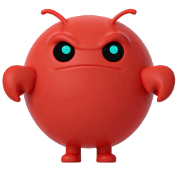

  

  <h3>CrazeClaw</h3>
  <h4>Openclaw 引发了全球养龙虾的热潮。🦞</h4>

  <a href="./README.md">English</a> /
  中文

OpenClaw 真正能做事的人工智能。您的跨平台个人助手。适用于任何操作系统的 AI 智能体 Gateway 网关，支持 WhatsApp、Telegram、Discord、iMessage 等。

Openclaw 引发了全球养龙虾的热潮，收集来自世界各地的 AI 龙虾产品。

# AI 龙虾产品

<h3 style="display:inline">Git & GitHub</h3>

- [OpenClaw](https://github.com/openclaw/openclaw) - 您自己的个人 AI 助手。任何操作系统。任何平台。龙虾方式。 🦞
- [Nanobot](https://github.com/HKUDS/nanobot) - 🐈 nanobot: 超轻量级 OpenClaw。
- [ZeroClaw](https://github.com/zeroclaw-labs/zeroclaw) - 快速、小巧且完全自主的人工智能助手基础设施——可部署到任何地方，随时更换任何组件 🦀 
- [PicoClaw](https://github.com/sipeed/picoclaw) - 小巧、快速、可部署在任何地方——自动化平凡事务，释放你的创造力。
- [NanoClaw](https://github.com/qwibitai/nanoclaw) - 一个轻量级的 OpenClaw 替代方案，可在容器中运行以增强安全性。可连接 WhatsApp、Telegram、Slack、Discord、Gmail 以及其他消息应用程序，具有记忆功能、计划任务，并直接运行在 Anthropic 的 Agents SDK 上。
- [IronClaw](https://github.com/nearai/ironclaw) - IronClaw 是一个受 OpenClaw 启发的 Rust 实现，专注于隐私和安全。
- [MimiClaw](https://github.com/memovai/mimiclaw) - MimiClaw：在一个 5 美元的芯片上运行 OpenClaw。没有操作系统（Linux）。没有 Node.js。没有 Mac mini。没有 Raspberry Pi。没有 VPS。硬件代理操作系统。
- [ClawX](https://github.com/ValueCell-ai/ClawX) - ClawX 是一款桌面应用程序，为 OpenClaw AI 代理提供图形界面。它将基于命令行的 AI 协作转变为桌面体验，无需使用终端。
- [HiClaw](https://github.com/alibaba/hiclaw.git) - 开源代理团队系统，具有基于即时消息的多代理协作和人工干预监管。
- [TinyClaw](https://github.com/TinyAGI/tinyclaw) - TinyClaw 是一个由个人代理组成的团队，它们相互协作。
- [LobsterAI](https://github.com/netease-youdao/lobsterai) - 您的全天候、全场景 AI 助手，为您完成工作。
- [PhoneClaw](https://github.com/rohanarun/phoneclaw) - 一个 OpenClaw/Clawdbot 的版本，完全在不获取 root 权限的情况下自动化安卓手机，包括从侧载 APK 安装的所有应用。作为你手机上的 24/7 个人助手。

<h3 style="display:inline">公司</h3>

- [MaxClaw](https://maxclaw.ai) -MaxClaw 是 MiniMax 官方云托管的 AI 代理，基于开源的 OpenClaw 框架构建，由 MiniMax M2.5 模型提供支持。
- [KiloClaw](https://kilo.ai/kiloclaw) - 您的个人 AI 代理，由 Kilo 管理和保护。通过 500 个模型、企业级安全性和零 DevOps，秒级部署 OpenClaw。
- [JVS Claw](https://jvs.wuying.aliyun.com/) - 基于 OpenClaw 框架打造，云端&本地均可一键部署，免除繁琐配置，
多端访问，即刻启动。
- [QClaw](https://claw.guanjia.qq.com) - QClaw 是腾讯电脑管家团队基于 OpenClaw 打造的本地 AI 助手，支持 Mac 和 Windows 双端。
- [EasyClaw](https://easyclaw.com) - 基于 OpenClaw 框架打造。一键安装，免除繁琐配置，集成各家顶级模型。

